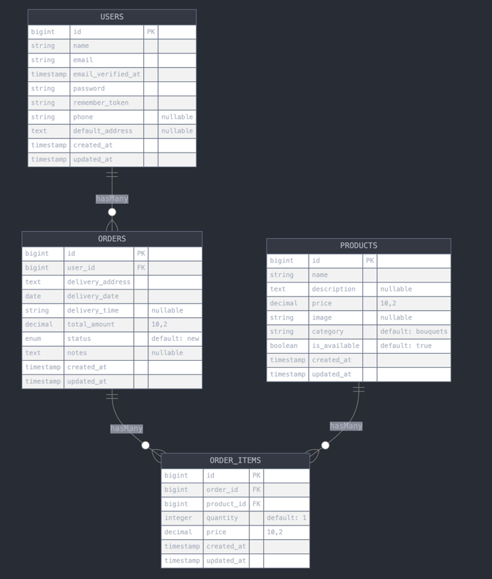

## База данных

### Таблицы:
- **products** - товары (букеты, подарки)
- **users** - клиенты
- **orders** - заказы
- **order_items** - товары в заказе

### Основные связи:
- User -> Orders (1:many)
- Order -> OrderItems (1:many)
- Product -> OrderItems (1:many)
- 

